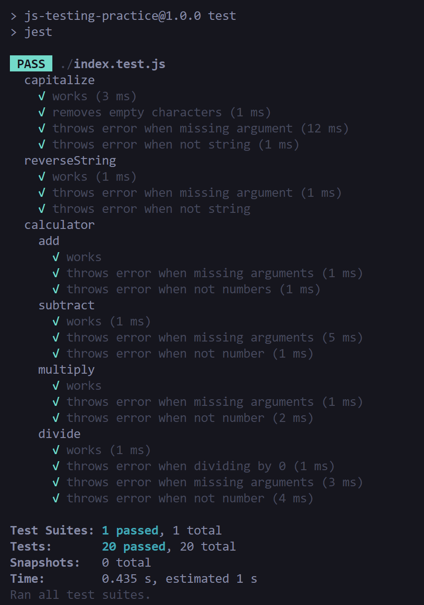

# js-testing-practice

In this project I used Jest to unit test and build each functions in a step-by-step basis. The functions are basic such as `analyzeArray`, `calculator`, etc.

I made the unit tests in a way to fail on several edge cases such as to prevent obvious hard coded return value, wrong type input, etc.

